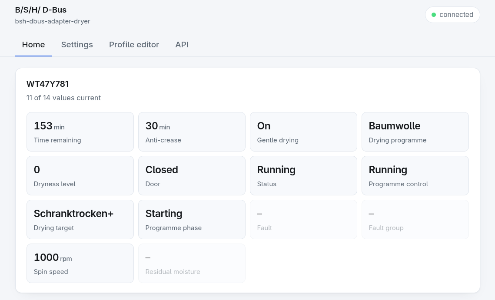
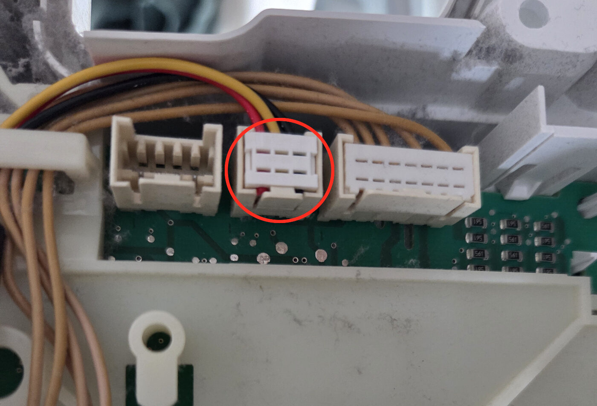
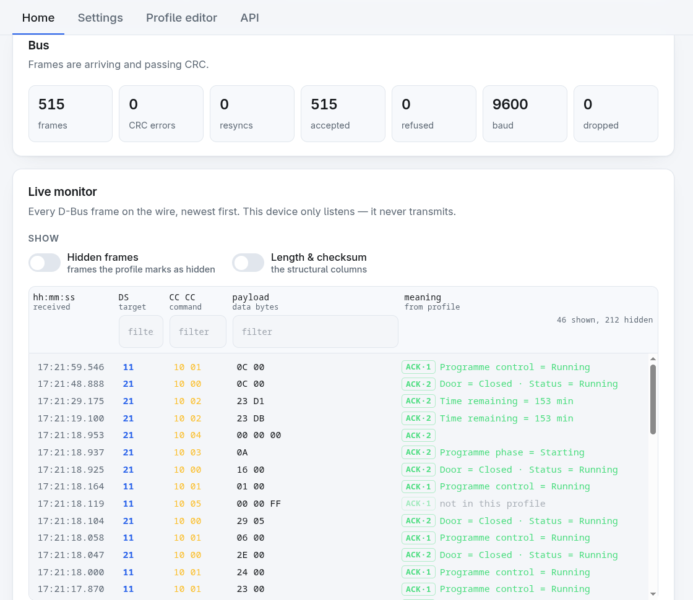
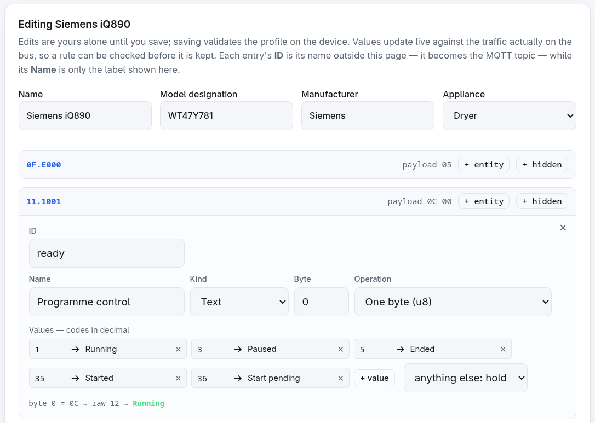

# bsh-dbus-adapter

[](https://github.com/bruestel/bsh-dbus-adapter/actions/workflows/ci.yml)

Firmware for a small ESP32 adapter that listens to the **D-Bus**, the internal
serial bus of Bosch / Siemens / Neff / Gaggenau / Constructa household
appliances, and tells you what the machine is doing.

It sits inside the appliance, draws its power from the bus, and reads the
traffic between the appliance's own boards. What the bytes mean comes from a
**runtime JSON profile**, so a new model is a file rather than a firmware
build. The readings go out over **MQTT** and a **REST API**, and the device
serves a web interface with a live bus monitor, an editor for writing a profile
against the traffic in front of you, and over-the-air updates.

Readings are announced over MQTT discovery, so the appliance shows up in Home
Assistant as a device with its entities, without a line of YAML. Values are
retained, so whatever connects next sees the current state instead of waiting
for the machine to change its mind.

The firmware is **strictly read-only**. It never transmits on the bus: there is
no send path in the code at all, not even a disabled one. It registers only as a
non-addressable observer, so the appliance never sees it.

> **Not affiliated with B/S/H/.** This is an independent hobby project, written
> for my own appliance and published in case it is useful to someone else. It is
> not endorsed by, sponsored by, or connected to Bosch, Siemens, Neff, Gaggenau,
> Constructa or BSH Hausgeräte GmbH in any way, and no intellectual property of
> theirs was used: the protocol knowledge here comes from the public
> reverse-engineering work credited at the end. All product names and trademarks
> belong to their respective owners.



*What it looks like: the device's own page, a dryer halfway through a cycle. The
values come from the profile for that model; nothing here is hard-coded.*

## Warning

> Household appliances work with high voltages and currents. Even if parts of an
> appliance operate at low voltages, they may or may not be isolated from earth,
> and in case of a fault can expose dangerous voltages. There is a good chance of
> death or serious injury. They generate heat and steam, they shake and vibrate,
> they have rotating parts and they get wet. Take appropriate safety measures.
>
> ⚡ I am neither responsible nor liable if you kill your cat, your spouse,
> yourself, or set your house on fire. You have been warned. This is meant for
> people who are already comfortable working on mains-powered appliances.

**The D-Bus is not guaranteed to be isolated from mains earth.** On some models
it is, on others it is not, and you cannot tell by looking. So:

- **Never connect the adapter to an appliance and a computer at the same time.**
  That includes USB for flashing, for the serial console, and for power alone.
  Set the device up on the bench, then take it to the appliance; behind the
  appliance it is reachable over WiFi and nothing else, which is why everything
  here, updates included, can be done over the network.
- Treat the wiring as live while the appliance is plugged in. Unplug it before
  touching anything inside; switching it off is not enough.

This is a hobby project and it comes with **no warranty of any kind**: not that
it works, not that it is safe, not that it will leave your appliance intact.
Everything you do with it is at your own risk.

What the software can promise is narrow, and worth stating exactly: the firmware
has no send path at all, and a CI check rejects any UART write call, so it
cannot command the appliance to do anything. That covers the code. It says
nothing about the wiring, which is where the danger is.

## The bus, and whether your appliance has one

The D-Bus is the internal wiring between an appliance's boards (the power
module, the control panel, the sensors), not a service port. It is a three-wire
affair: **GND, VBUS and DATA**, where DATA is a single 5 V TTL line that
everything shares, 8N1, usually at 9600 baud and on newer machines at 19200 or
38400.

**You do not have to know which rate yours uses.** The firmware tries all three
at boot and keeps the one that produces plausible frame lengths and valid
checksums, so a machine that turns out to be faster than expected costs nothing
but a few seconds of scanning. If the scan settles on the wrong answer, or the
wiring is off, the blue LED says so: a steady 4 Hz blink means bytes are
arriving but failing their checksum, which looks quite different from the dark
LED of a bus that is silent.

VBUS is what powers the adapter, and it depends on the appliance: **9 V** in
washing machines, **13.5 V** in dishwashers, **5 V** in extractor hoods. All
three are within range of the converters on the adapter boards.

The connector is a **three-pin RAST 2.5**, the coded type Lumberg and
Stocko make, the same family used throughout the appliance, so it cannot be
plugged in the wrong way round. B/S/H/ also sells ready-made cables as spare
parts. One catch worth knowing before you crimp anything: the pin order is
mirrored between the two ends. The power module is GND-DATA-VBUS, the sensors
are VBUS-DATA-GND, and the cable crosses the wires.

The bus is on the "EP" generation of boards: EPW in washing machines, EPT in
dryers, EPG in dishwashers. How reachable it is varies: some dishwashers expose
it through recesses in the power connector meant for service staff, elsewhere it
means opening the machine. The upstream project documents all of this in far
more detail than belongs here, including photographs, part numbers and the
protocol itself: [hn/bsh-home-appliances](https://github.com/hn/bsh-home-appliances#d-bus).

There is no list of supported appliances, because the bus is not a feature a
model either has or lacks; it is how these machines are built internally. What
varies is whether anyone has worked out what its frames mean on your model, and
that is what a profile is.

### Finding the connector

There is no single place to look, so look in this order:

- **The control panel board**, behind the fascia. This is where the bus is
  easiest to reach on many machines, and boards often carry a spare three-pin
  header for exactly this purpose.
- **The power module**: EPW in washing machines, EPT in dryers, EPG in
  dishwashers.
- **The power connector**, on dishwashers: some expose the bus through recesses
  meant for service staff, which is the one case where nothing has to come apart.

What you are looking for is a three-pin RAST 2.5 connector, quite often
unpopulated.

As a worked example, the dryer this firmware was written against: two screws at
the back hold the lid, and with those out the lid slides backwards and lifts
off. A few more screws hold the front, and behind it you reach the back of the
display. The bus was right there:



*The circled connector is the bus, three pins between two wider neighbours.
Which of its outer pins is which, and whether a three-pin header you find on
another machine is really the bus, the multimeter below will tell you.*

On this dryer the header was free and the adapter plugged straight into it. A
header you find may well be occupied instead, in which case look over the
board for a free one: the D-Bus is a shared line that every board on it
listens to, so an adapter on any spare header hears everything without
displacing anything. This firmware only ever listens, so nothing on the bus
notices it is there.

### Telling the three pins apart

A multimeter settles it in two measurements. Both need the appliance plugged in
and switched on, which is precisely the situation the warning above is about:
keep the probes on the low-voltage connector, and stay away from everything on
the mains side of the board.

1. **Measure between the two outer contacts.** That is VBUS against GND: around
   9 V in a washing machine, 13.5 V in a dishwasher. The sign tells you which is
   which: when the reading is positive, the black probe is on GND.
2. **Measure between GND and the middle contact.** That is DATA, and it should
   read roughly 5 V. It will not sit still: the number wanders, because the
   line is carrying traffic while you measure. That wandering is the useful
   part: a steady 5 V is some other supply, a restless one is the bus.


## First start

With no WiFi credentials stored the device opens its own open network named
after itself, e.g. `bsh-dbus-adapter-04b1c4`, and serves a setup page at
<http://192.168.4.1/>. Most phones offer it automatically through the captive
portal. Enter the network credentials there; the device restarts to join.

**Saving WiFi credentials always restarts the device**, and that is deliberate.
Switching from the setup network to a station without restarting puts the one
radio in an impossible position: the access point runs on a fixed channel and
the station has to follow the router's, which in a house with two access points
is often a different one. The device then reports itself connected, correctly,
while barely passing a packet — and the phone reading that report loses the
setup network from under it, because that moved channel too. Restarting costs
about five seconds and removes the situation: on the way up there is no access
point to accommodate.

**The setup network is not permanent.** It exists only when there is no other
way in, and disappears when the device restarts to join the network you gave
it. Rejoin your own WiFi and look for the device there. It reopens its own
network by itself if the connection is lost for good.

Once connected the device is reachable at its IP or, via mDNS, at
`http://<device-name>.local/`. It also registers its name over DHCP, so it
appears under that name in the router instead of as a generic `espressif`.

Password protection is **off by default** and has to be switched on in the web
UI after choosing a password. Once on, it applies everywhere, including the
fallback access point: jamming the WiFi is enough to push the device into
access-point mode, and an open setup network would hand every setting to whoever
is nearby.

## Getting back in

Holding the **BOOT button for five seconds** while the device is running erases
the stored WiFi credentials *and* the password, then reboots into setup mode.
Both LEDs light steadily after one second to show the hold has registered; let
go before five seconds and nothing happens.

This is the way back into a device that joined a network you cannot reach,
where neither automatic fallback helps, because the connection did not fail.
Appliance profiles and bus settings are untouched.

Note that BOOT is also the strapping pin: holding it *while resetting* enters
the chip's download mode instead. Press it only once the board is up.

**This does not exist on the BaSHi, deliberately.** On the C3 the boot pin is
GPIO9, and the BaSHi wires that same pin to the level shifter as the bus TX
line. The button on the module shorts it to ground, so holding it would pull
DATA low for as long as it is held, which is the one thing this firmware
promises never to do. The recovery hold is switched off for that target, and
the way back into a BaSHi is a cable.

## A profile for your appliance

A profile is a JSON file that says what the frames on one model mean: which
address carries the remaining time, which byte holds the door, what programme
code 35 is called. It is data, not code, and it loads at runtime, so a new one
is a file rather than a firmware build. Twenty-three ship with the firmware:
twenty-two converted from the ESPHome configurations the community wrote over
the years, and one written in the editor described below. The models covered
are listed in [`profiles/`](profiles/): washing machines, dryers, dishwashers,
an oven, a fridge and a steamer.

That collection came from [the upstream
project](https://github.com/hn/bsh-home-appliances/tree/master/contrib), where
people have been contributing configurations per model for years, and it keeps
growing. It is the place to look first: if your machine has been mapped by
anyone, it has most likely been mapped there.

The device does not ask the appliance what it is; asking would mean
transmitting. It listens, collects the addresses it hears, and ranks the
profiles that match. If yours is among them, one click uses it.



*The live monitor is where that listening becomes visible: every frame on the
wire, and beside it what the active profile makes of it. Frames it explains
nothing about say so plainly, and those are the raw material for the next one.*

If your exact model is not there, you have three ways forward, in increasing
order of effort:

1. **Use the generic profile for the family.** Dryers, washing machines and
   dishwashers share their basic decoding across models, so the generic entry
   gets the values right: remaining time, door, machine state. What it cannot
   do is name things: programmes come out as numbers, because the codes differ
   per model. That is often enough.
2. **Write one in the editor.** The web UI has a profile editor built around the
   live monitor: click a frame, mark the bytes, choose how to read them, and the
   value appears against the traffic as you work. Save it and the device uses
   it. This is the intended path, and it needs no toolchain, just the appliance
   doing things while you watch.

   

   *One reading being worked out. The codes on the left are what the appliance
   sends, the names on the right are what you decide they mean, and the line
   underneath applies the rule to the traffic arriving right now, so a guess
   can be checked before it is saved.*
3. **Convert an existing ESPHome configuration.** If your model appears in the
   [upstream collection](https://github.com/hn/bsh-home-appliances/tree/master/contrib)
   but not in `profiles/`, which happens as that collection grows,
   `tools/esphome2profile.py` turns the YAML into a profile and reports what it
   could not translate. Step by step below.

Either of the last two produces a file worth sharing, and the editor exports a
profile as JSON or as an upstream ESPHome configuration, so it can go back to
whichever project the next person is using.

### Converting an ESPHome configuration

The upstream configurations are the accumulated work of people with these
machines in front of them, so the converter translates them mechanically and
lists what it could not translate rather than guessing. Start with the YAML for
your model:

```bash
curl -O https://raw.githubusercontent.com/hn/bsh-home-appliances/master/contrib/bsh-dbus-<model>.yaml
python3 tools/esphome2profile.py --out profiles/ --report /tmp/report.md bsh-dbus-<model>.yaml
```

The report is the interesting output. A conversion is rarely complete, and the
entries name each entity it gave up on, with the beginning of the lambda that
defeated it:

```
- **bsh-dbus-wtw85460de.yaml** -> `wtw85460de.json` -- 7/11 entities (64%), 10 groups, dryer
  - bsh-dbus-wtw85460de.yaml:bsh_dryer_status: lambda not converted -- if (x[0] == 22) { id(dryer_running_last_state) = true; ...
```

Those are the ones to finish by hand, in the editor or in the JSON. Usually they
are lambdas that keep state between frames, which the schema expresses as a
`lookup` with `default: "hold"` rather than as code.

Check the result against the parser that actually runs on the device, which is
stricter than the converter:

```bash
cmake -S test/host -B test/host/build && cmake --build test/host/build
./test/host/build/validate_profiles profiles/<model>.json
```

Then try it on the appliance without building or flashing anything. A profile
can be uploaded to a running device and stored beside the built-in ones:

```bash
curl -X PUT --data-binary @profiles/<model>.json \
     "http://<device>/api/v1/custom?id=custom:<model>&activate=1"
```

Leave off `&activate=1` to store it without switching to it. It appears under
"Your profiles" in the editor, where the live monitor will show you within
seconds whether the addresses were right. `curl -X DELETE
"http://<device>/api/v1/custom?id=custom:<model>"` removes it again.

None of that needs a terminal. The same steps are in the interface, on the
**Profile editor** tab: **Upload a profile…** takes the JSON file, asks what to
call it, and opens it as an unsaved draft, so you can read it over and fix what
the converter left before anything is stored. **Save** validates it on the
device, **Save and activate** does that and switches to it in one step. In the
list of your own profiles, **Edit** reopens one, **Use** activates it, **Delete**
removes it, and **JSON** and **YAML** download it again, the second as an
ESPHome configuration in the shape the upstream project uses.

Once it decodes correctly, a pull request adding it to `profiles/` is welcome.
Keep the `credits` from the converted file: they name the people who worked out
the bytes in the first place, and that attribution should survive the format
change.

### How this differs from the ESPHome component

The decoding here started as a translation of those configurations, so most of
it behaves the same: `map:` is a map, `multiply:` is a multiply,
`calibrate_linear:` is a calibrate. Five things are genuinely different.

| | ESPHome | Here |
| :--- | :--- | :--- |
| Adding a model | Edit YAML, rebuild, reflash | A JSON file, uploaded to a running device |
| A value that only changes | A `globals:` variable plus a lambda to hold it | `lookup` with `default: "hold"` |
| A reading to ignore | Return early from the lambda | `default: "drop"`, or `filter_out` |
| A remaining time between updates | Shows the last value until the appliance speaks again | Counted down, but only while a named entity says the machine is running |
| A frame shorter than expected | `x[4]` reads past the buffer | Refused by `min_len` and counted |

The countdown is the one worth explaining, because it changes what you see. This
dryer does not report its remaining time steadily: in one recorded run it went
30, 29, 28 and then straight to 19, losing nine minutes in a single step before
settling into minute-by-minute updates. ESPHome shows exactly what arrives,
which is correct and reads like a fault. The engine fills the gaps instead,
subtracting a minute at a time, and marks a value it produced that way as
estimated, so the page can distinguish the device counting from the appliance
talking.

The gate is not decoration. A remaining time only advances while the machine is
running: at rest the same frame carries the expected duration of the selected
programme, and a paused machine re-estimates when it resumes. Counting in either
state would produce a confident, wrong number, so without a gate the countdown
does not run at all.

Two things ESPHome does better, and they are not small. Its Home Assistant
integration is native rather than by MQTT discovery, with an ecosystem and
documentation behind it. And it covers more: of the 274 entities in the
configurations converted here, [83%](docs/conversion-report.md) came across
mechanically, and the rest are lambdas that keep state across frames or do
arithmetic no schema anticipated. Those entities are missing from the profiles
until somebody finishes them by hand. If what you want is your washing machine
in Home Assistant with the least work, the upstream component is still the
shorter path.

## What it publishes

Over MQTT, under a topic root that defaults to `bshdbus/<device-name>`:

| Topic | Retained | Payload |
| :--- | :---: | :--- |
| `<base>/status` | ✔ | `online` / `offline`; also the last will, so a dead adapter corrects itself |
| `<base>/state/<entity>` | ✔ | the value; an empty payload means the reading went stale |
| `<base>/frame` | ✘ | every frame as hex, when raw frames are switched on |

Because the values are retained, whatever subscribes next sees the current state
straight away rather than waiting for the appliance to do something, which on
an idle machine can be hours.

With discovery enabled, the same readings are announced under
`homeassistant/…`, and the appliance appears in Home Assistant as a device with
its entities, no YAML required. Entities that a later profile no longer has are
withdrawn rather than left behind as permanently unavailable.

Everything is also available over HTTP: `/api/v1/readings` for the decoded
values, `/api/v1/frames` and a WebSocket for the live bus. The full API
reference is served by the device itself, at the bottom of its own settings
page, so it cannot drift from what the firmware actually does.

## Hardware

| Board | MCU | Bus RX | Bus TX | Status LED | Activity LED |
| :--- | :--- | :--- | :--- | :--- | :--- |
| [Bouni BSH-Board](https://github.com/Bouni/BSH-Board) | ESP32-C6 (4 MB) | GPIO4 | GPIO5 | GPIO6 (inv) | GPIO7 (inv) |
| [kiu BaSHi](https://github.com/kiu/BaSHi) | ESP32-C3 | GPIO10 | GPIO9 | GPIO8 | none |

Those are the two configurations that ship, not the two that are possible. The
pins are Kconfig options rather than constants, so any ESP32 that ESP-IDF
supports can run this: adding a board is an entry in `platformio.ini` and a set
of pin numbers, not a change to the firmware.

**The C6 configuration is the one that has run.** Everything in this repository
was developed against a Bouni board on a dryer, and its pin assignment is
confirmed twice over: by the schematic and by the upstream ESPHome
configuration for that board.

> ⚠ **Caution: the BaSHi configuration has not been tested on hardware yet.**
> Its pin numbers come from the pin definitions in the BaSHi project's own
> logger sketch. That is a good source but not a test: the firmware builds for
> that target, and nothing beyond that has been verified. Check the decoded
> values against what the appliance itself displays before trusting them, and
> please report how it went either way.

The BaSHi is a carrier board that takes different plug-in modules, and the
pins are not the same on each. The target here matches the **C3 Super Mini**.
For the others, from the same sketch:

| Module | Bus RX | Bus TX | LED |
| :--- | :--- | :--- | :--- |
| ESP32-C3 Super Mini | GPIO10 | GPIO9 | GPIO8 |
| ESP32-C6 Super Mini | GPIO3 | GPIO2 | GPIO8 (RGB) |
| ESP32-S3 Super Mini | GPIO4 | GPIO3 | GPIO48 (RGB) |
| ESP32-C3 Zero | GPIO0 | GPIO1 | GPIO10 (RGB) |

Those are Kconfig options, so running one of them is a matter of `pio run -t
menuconfig` rather than a code change. The RGB LEDs on the newer modules are
addressable and this firmware drives a plain GPIO, so on those the status light
will not work.

What the adapter has to provide is not the MCU but the two parts around it: an
**open-drain level shifter** for the single-wire bus, and a **DC-DC converter**
to run the board off the 9–13.5 V the appliance supplies. A bare development
board wired straight to the bus is neither safe nor reliable. The upstream
project keeps [the list of adapter
designs](https://github.com/hn/bsh-home-appliances#d-bus-adapter): four of
them, including a minimalist one that fits entirely inside the connector.

If you would rather not build anything, [Bouni offers assembled
boards](https://github.com/Bouni/BSH-Board/issues/1), though how long that
stays available is up to him, and it is a favour rather than a shop. **Order the
connectors with it.** A board without the mating RAST 2.5 plug and a length of
cable cannot be attached to anything, and sourcing three-pin RAST parts
afterwards is more annoying than it sounds. Either way the board is open
hardware: schematic, layout and BOM are in that repository, so it can be
ordered from any fab even if nobody is assembling them.

### LEDs

The board has three LEDs. All are active low (anode at 3.3V, cathode through a
510R resistor to the GPIO). Behind an appliance they are the only feedback
channel, so they distinguish the cases you would otherwise be blind to.

| LED | Colour | Driven by |
| :--- | :--- | :--- |
| D4 | red | nothing; hardwired power indicator |
| D5 | green | GPIO6, system and network state |
| D6 | blue | GPIO7, bus state |

**D5 green** (`#` = on, one character = 50 ms):

```
booting / baud scan   ########################################  solid
waiting for setup     ##__##__##__##__##__##__##__##__##__##__  5 Hz
WiFi not connected    ##_##___________________________________  two flashes
online, bus silent    #_______________________________________  heartbeat
online, frames flow   _#######################################  inverted heartbeat
fatal error           #_#_#_#_#_#_#_#_#_#_#_#_#_#_#_#_#_#_#_#_  10 Hz
```

**D6 blue**:

```
bus silent            ________________________________________  off
valid frames          one 30 ms blip per frame                  flicker
bytes but no frames   ##___##___##___##___##___##___##___##___  4 Hz
```

Steady 4 Hz blue means bytes are arriving but failing CRC, usually a wrong
baud rate or miswiring, not a dead bus.

**During an OTA update** both LEDs run in antiphase. Do not remove power.

Bus is UART 8N1 at 9600 baud (some newer appliances use 19200 or 38400) on a
single DATA wire. Every transmitted byte echoes back on RX; the protocol stack
relies on that for collision detection.

## Installing without a toolchain

The first flash is the only step that needs a cable, and it does not need a
development environment: the [web installer](https://bruestel.github.io/bsh-dbus-adapter/)
writes the firmware from Chrome or Edge over USB. Everything after that happens
over the network, updates included.

**Flash the board on its own.** The installer needs USB, and a board on USB must
not be attached to an appliance at the same time, for the reason in the warning
above. Set it up on the bench, then take it to the machine.

Each release also carries the images as attachments, for flashing by hand:
`bsh-dbus-adapter-<board>.bin` is a merged image for `esptool write_flash 0x0`,
which blanks the device, and `bsh-dbus-adapter-<board>-app-only.bin` is the
application alone, which is what the device's own update page accepts.

## Building

PlatformIO with `framework = espidf`, pinned to `espressif32@7.0.1`, which
provides **ESP-IDF 6.0.1**. The version is pinned deliberately: a silent bump
would swap the ESP-IDF underneath a timing-sensitive protocol stack.

```bash
pio run -e bouni-c6                 # build
pio run -e bouni-c6 -t upload       # flash
pio device monitor                  # serial console
pio run -e bouni-c6 -t menuconfig   # board pins, options
```

The scripts under `tools/` generate the embedded assets, guard the profiles and
convert configurations; [`tools/README.md`](tools/README.md) says which is
which, and which of them run on every build.

Host-side unit tests need no hardware and no ESP-IDF:

```bash
cmake -S test/host -B test/host/build && cmake --build test/host/build
ctest --test-dir test/host/build
```

## When it crashes

The device registers its main loop with the task watchdog and stores a core dump
in flash on a panic, so a crash behind an appliance leaves evidence and the
device recovers by itself. Settings → Health shows the reset reason, per-task
stack headroom and whether a dump is stored.

To read a dump you need **the exact ELF of the firmware that crashed**, because
`esp-coredump` checks the application hash and refuses a mismatch:

```
Failed to load core dump: Invalid application image for coredump:
coredump SHA256(e6d295de4) != app SHA256(6bd680bce).
```

That is correct behaviour, not a fault, but it means the ELF must be kept for
every build that gets flashed or sent over the air. `.pio/build/<env>/firmware.elf`
is overwritten by the next build, so archive it alongside the `.bin` you deploy.

```bash
esp-coredump info_corefile -t raw -c coredump.bin firmware.elf
```

## Credits and license

This project is a derivative work of
**[hn/bsh-home-appliances](https://github.com/hn/bsh-home-appliances)** by
**Hajo Noerenberg**, specifically the `open-dbus2` protocol stack and the
reverse-engineering documentation of the D-Bus. The appliance decoder profiles
in `profiles/` are converted from the ESPHome YAML configurations in that
project, which were contributed by many people; per-profile `credits` fields
record the original authors.

Licensed under the **GNU General Public License version 3.0**, the same license
as the original work. See [LICENSE](LICENSE).

The firmware images are more than this source: building links in ESP-IDF and a
handful of components, all under licences that combine into a GPLv3 work.
[THIRD-PARTY-NOTICES.md](THIRD-PARTY-NOTICES.md) records which, whose and under
what.
